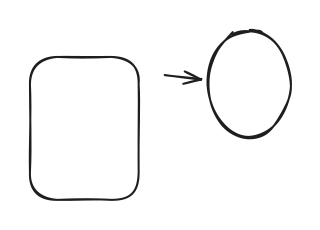

# Page 1




Tab 1 jrfjeejr

kfrfelkjfrkjferfe



fjhwjfwkjfwkcwkwef




Eii, hint


| Tab | User   | Phone |
| --- | ------ | ----- |
| dew | fewfwe | 455   |
| 3   | 44     | 55    |
|     |        |       |

<details>

<summary>ewfwef</summary>

rffefer

</details>

<table data-view="cards"><thead><tr><th></th><th></th><th></th><th data-hidden data-card-cover data-type="files"></th></tr></thead><tbody><tr><td>aisiis</td><td></td><td></td><td></td></tr><tr><td>edwdewdwdwd</td><td></td><td></td><td><a href=".gitbook/assets/arquitectura_general_illa.drawio.png">arquitectura_general_illa.drawio.png</a></td></tr><tr><td></td><td></td><td></td><td></td></tr></tbody></table>




```java
Class User {
int age;
String name;
 public User(String name, int age) {
  this.name =name;
  this.age=age; 
  }
  
  public int getAge() {
    return age;
  }
}
```


***



Holal

hjoaoala

flfrmferferergerg
